# SimLab - Physics &amp; Visual Sandbox

A collection of ten self-contained canvas experiments in physics and generative
visuals. No build step, no dependencies — just plain HTML, CSS, and JavaScript.

Open [index.html](index.html) for the gallery, or jump straight into any project
folder below.

## Live Demo

**[Try it online →](https://simlab.vercel.app/)**

## Running it

- **Easiest:** open [index.html](index.html) directly in a browser.
- **Recommended** (avoids any `file://` quirks, especially for the `ImageData`
  based demos):
  ```bash
  # from inside the sandbox/ folder
  python -m http.server 8000
  # then visit http://localhost:8000
  ```

## The experiments

| Project | Folder | What it demonstrates |
|---|---|---|
| Particle Gravity | [particle-gravity/](particle-gravity/) | Softened inverse-square attraction |
| N-Body / Solar System | [n-body/](n-body/) | Mutual Newtonian gravity + orbital seeding |
| Spring-Mass Cloth | [cloth/](cloth/) | Verlet integration + distance constraints |
| Game of Life | [game-of-life/](game-of-life/) | Conway's cellular automaton |
| Reaction-Diffusion | [reaction-diffusion/](reaction-diffusion/) | The Gray-Scott model |
| Falling Sand | [falling-sand/](falling-sand/) | Cellular material simulation |
| 2D Ripple | [ripple/](ripple/) | The discrete wave equation |
| Double Pendulum | [double-pendulum/](double-pendulum/) | Deterministic chaos (RK4) |
| Fractals | [fractals/](fractals/) | Escape-time Mandelbrot / Julia sets |
| Harmonograph | [harmonograph/](harmonograph/) | Damped superimposed sinusoids |

## Gallery
||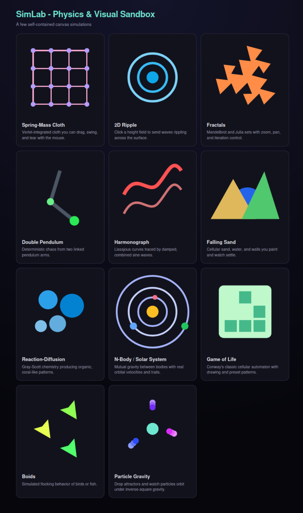||
|---|---|---|
| 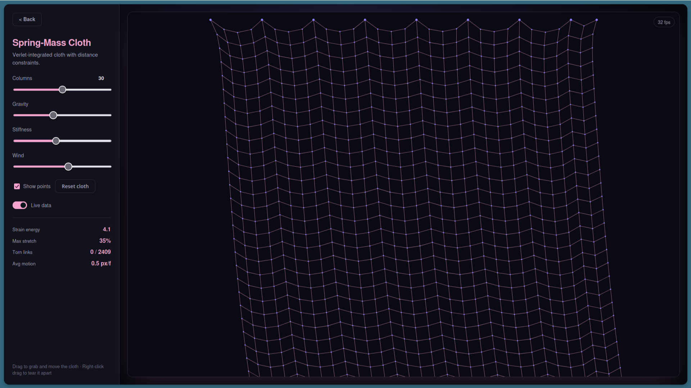 | 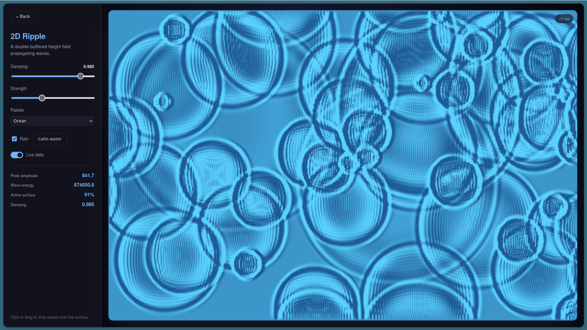 | 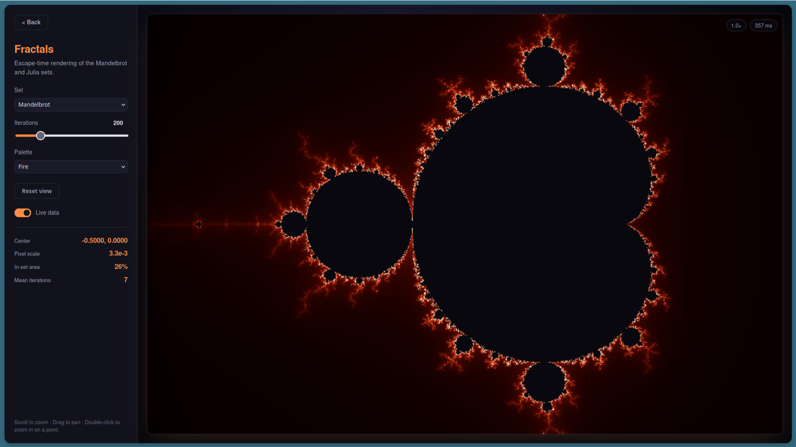 |
| 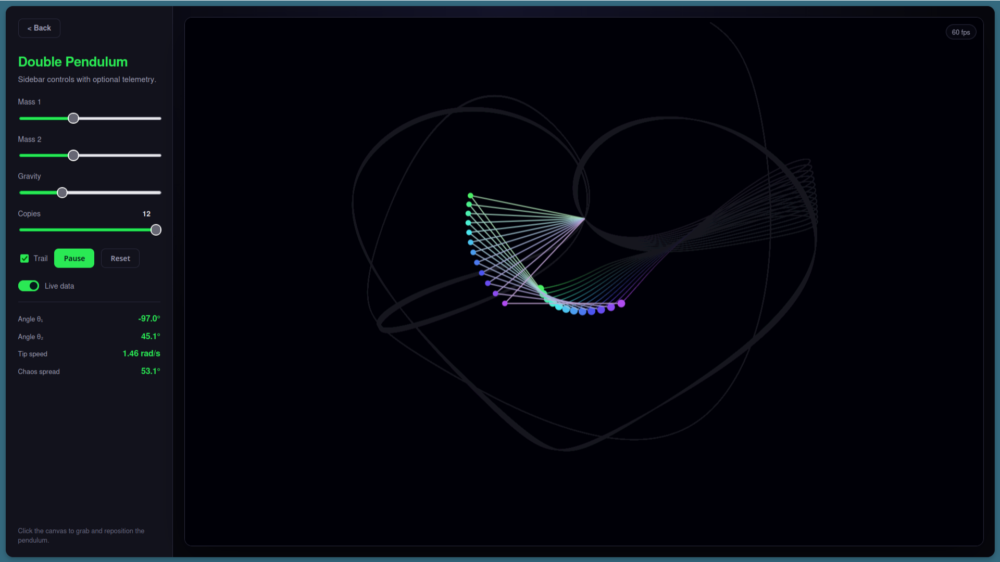 | 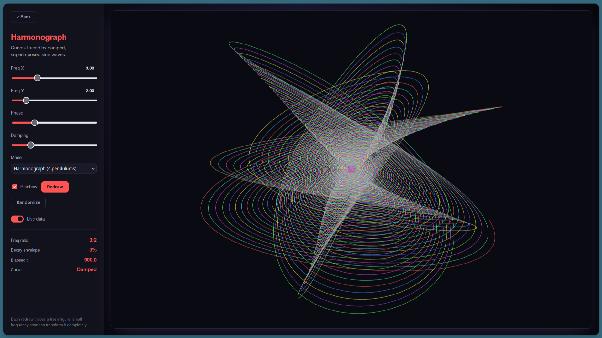 | 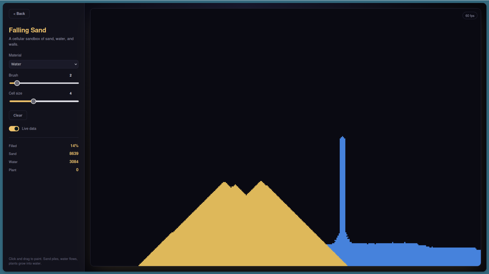 |
| 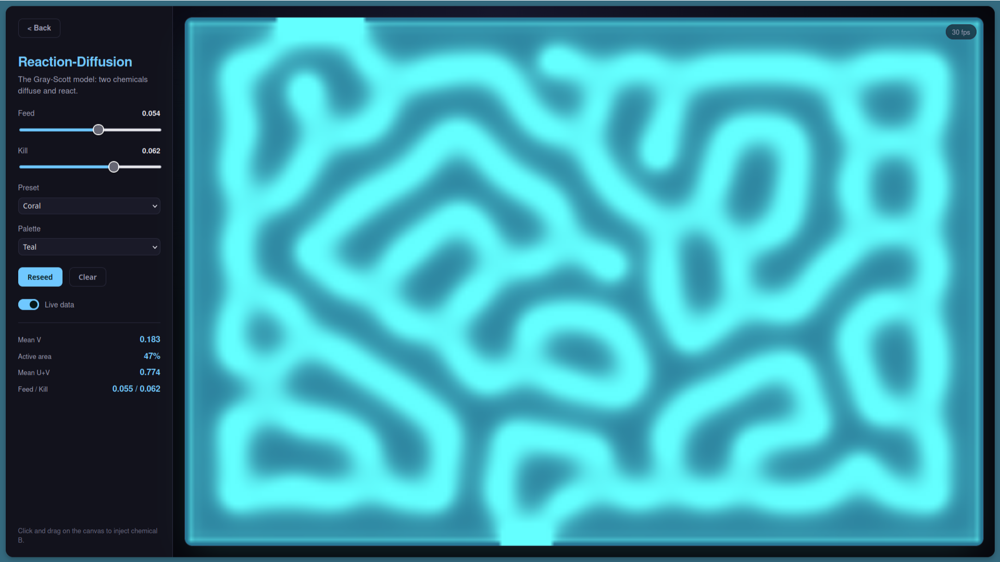 | 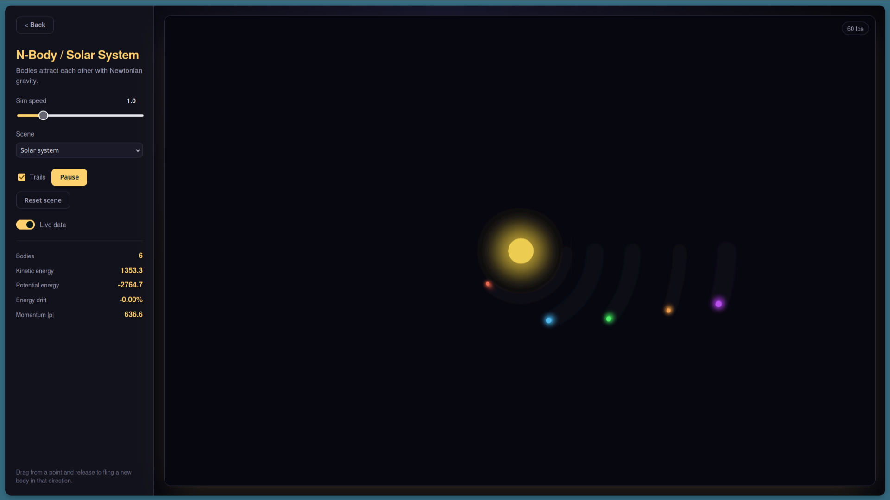 | 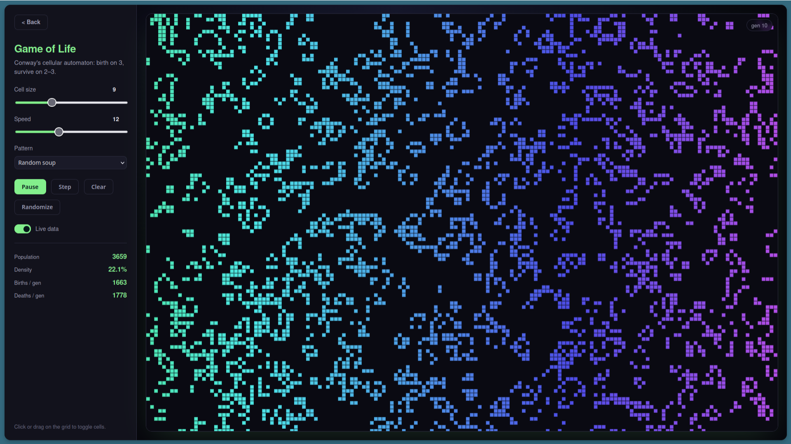 |
| 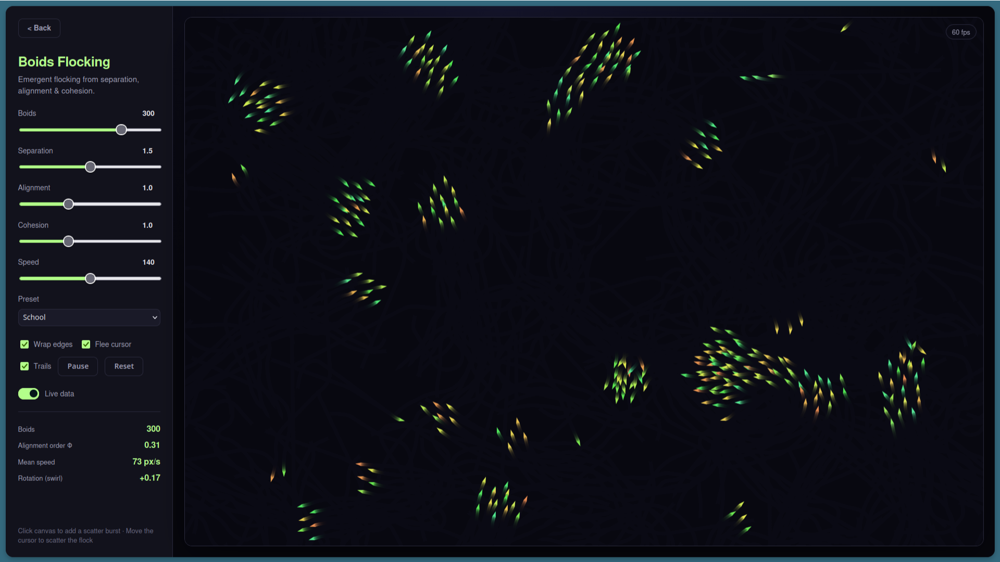 | 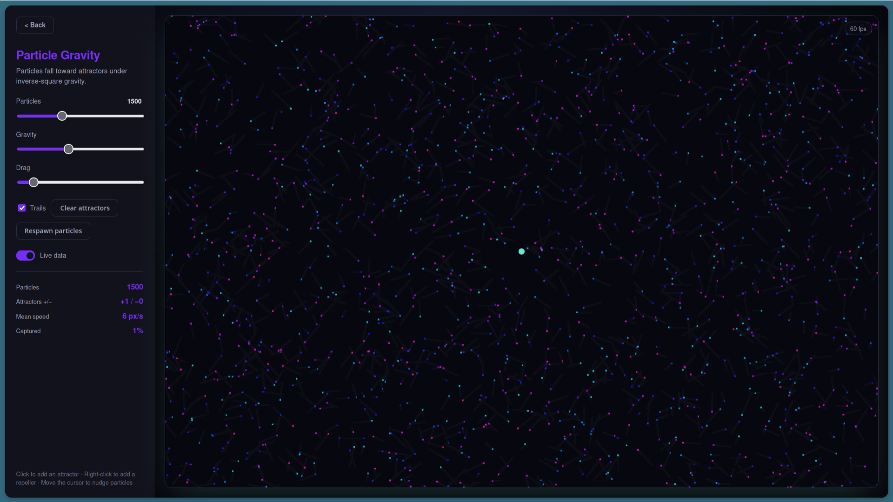 | |

Each folder has its own `index.html`, `main.js`, and `README.md`. All eleven share
a single stylesheet, [common.css](common.css).

## Shared conventions

Every demo follows the same patterns (carried over from the companion boids
project):

- **DPR-correct canvas** — the backing store is scaled by `devicePixelRatio`
  so rendering is crisp on high-density displays.
- **Fixed-timestep integration** where determinism matters (gravity, cloth,
  pendulum) via an accumulator loop, so behaviour is frame-rate independent.
- **Typed arrays + `ImageData`** for the grid/field simulations (life,
  reaction-diffusion, sand, ripple, fractals) to keep per-pixel work fast.
- **Pointer events** for unified mouse/touch interaction.
- A consistent dark control-panel UI defined once in `common.css`.

## License

Provided as-is for learning and experimentation.
